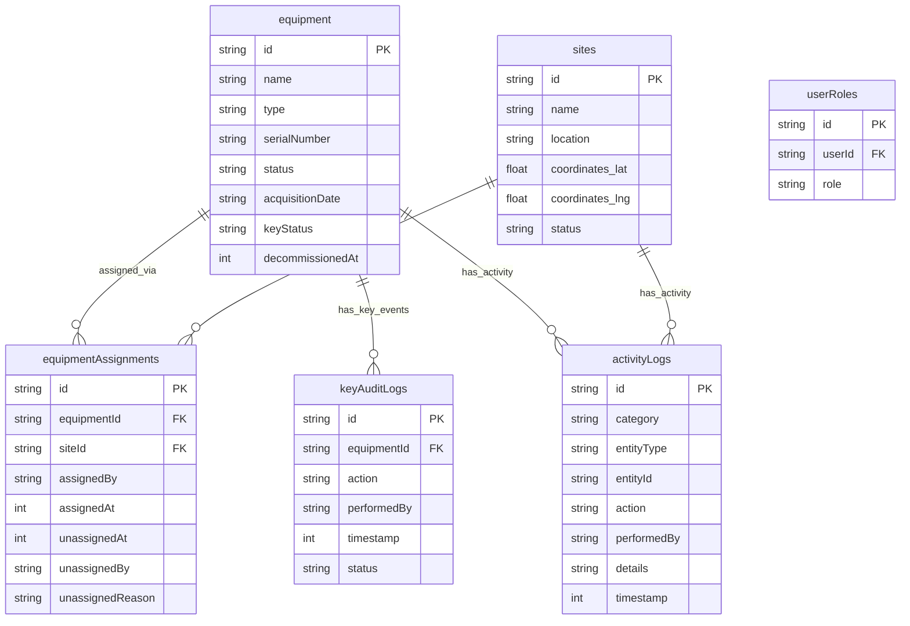

# IronLog — Heavy Equipment Tracking System

> **Field Operations Console** for construction firms to manage heavy equipment, site deployments, key custody, and access control in one centralized platform.

---

## Table of Contents

1. [Overview](#overview)
2. [Tech Stack](#tech-stack)
3. [Project Structure](#project-structure)
4. [Features](#features)
   - [Equipment Registry](#1-equipment-registry)
   - [Site Assignment](#2-site-assignment)
   - [Map Visualization](#3-map-visualization)
   - [Key Checkout Audit Log](#4-key-checkout-audit-log)
   - [Role-Based Access Control](#5-role-based-access-control)
5. [Data Model](#data-model)
6. [Roles & Permissions](#roles--permissions)
7. [Authentication](#authentication)
8. [Getting Started](#getting-started)

---

## Overview

IronLog is a real-time heavy equipment tracking platform built for construction firms. It gives fleet managers, site supervisors, operations managers, and executives a single console to:

- Maintain a live registry of all heavy equipment with statuses
- Assign and unassign machines to active construction sites
- Visualize equipment deployments on a map using geo-coordinates
- Track physical key custody with a tamper-evident audit log
- Enforce role-based permissions so each user sees and does only what they're allowed to

The system is built as a **reactive** application — all clients receive live data updates without polling, powered by Convex's real-time backend.

---

## Tech Stack

| Layer              | Technology                                             |
| ------------------ | ------------------------------------------------------ |
| Frontend Framework | React 19                                               |
| Routing            | TanStack Router (file-based, fully type-safe)          |
| Styling            | TailwindCSS v4 + shadcn/ui primitives                  |
| Build Tool         | Vite                                                   |
| Backend            | Convex (reactive BaaS — queries, mutations, real-time) |
| Authentication     | Better-Auth (email/password, cross-domain)             |
| Shared Types       | Zod schemas in `packages/types`                        |
| Monorepo           | Turborepo + pnpm workspaces                            |
| Language           | TypeScript (strict, end-to-end)                        |

---

## Project Structure

```
Javarice_Ironlog/
├── apps/
│   └── web/                   # React frontend application
│       └── src/
│           ├── components/    # UI components (dashboard, login, header, etc.)
│           ├── lib/           # Auth client setup
│           └── routes/        # File-based routes (TanStack Router)
├── packages/
│   ├── backend/               # Convex backend
│   │   └── convex/
│   │       ├── schema.ts      # Database schema (all tables)
│   │       ├── equipment.ts   # Equipment queries & mutations
│   │       ├── rbac.ts        # Role-based access control helpers
│   │       ├── activity.ts    # Activity log mutations
│   │       ├── auth.ts        # Better-Auth integration
│   │       ├── http.ts        # HTTP router (auth endpoints)
│   │       ├── seed.ts        # Test data seeder & scenario runner
│   │       └── seedAuth.ts    # Auth seeder
│   ├── types/                 # Shared Zod schemas & TypeScript types
│   │   └── src/
│   │       ├── equipment.ts   # Equipment types & validators
│   │       ├── sites.ts       # Site types & validators
│   │       ├── assignments.ts # Assignment types & validators
│   │       ├── audit.ts       # Key audit log types
│   │       ├── activity.ts    # Activity log types
│   │       └── rbac.ts        # Role & permission types
│   ├── ui/                    # Shared shadcn/ui component library
│   ├── config/                # Shared TypeScript base config
│   └── env/                   # Typed environment variable schemas
└── docs/
    ├── equipment_tracking.feature  # Gherkin BDD specs
    └── equipment_test_cases.md     # Manual test cases
```

---

## Features

### 1. Equipment Registry

The central module for managing all heavy equipment owned or operated by the firm.

**Capabilities:**

- **Register equipment** with name, type, serial number, acquisition date, and initial status
- **Prevent duplicate registrations** — serial numbers must be unique across the registry
- **Update equipment details** — name, type, serial number, status, acquisition date
- **Decommission equipment** — marks a unit permanently inactive; blocked if the equipment is currently deployed at a site
- **Filter by status** — view only Available, Deployed, Under Maintenance, or Decommissioned units
- **Activity log** — every registration, update, and decommission is automatically logged with performer identity and timestamp

**Equipment statuses:**

| Status              | Description                                   |
| ------------------- | --------------------------------------------- |
| `Available`         | In yard, ready for deployment                 |
| `Deployed`          | Assigned to and active at a construction site |
| `Under Maintenance` | Undergoing repairs; not assignable            |
| `Decommissioned`    | Permanently retired from service              |

---

### 2. Site Assignment

Manages which equipment units are deployed to which construction sites, with a full history of all assignments.

**Capabilities:**

- **Assign equipment to a site** — only `Available` equipment can be assigned; status automatically changes to `Deployed`
- **Prevent double-deployment** — equipment already `Deployed` or `Under Maintenance` cannot be reassigned without first being unassigned
- **Unassign equipment** — returns status to `Available`; records who unassigned it, when, and why
- **View equipment by site** — list all active equipment at a given site
- **Assign multiple units to one site** — sites can hold any number of equipment simultaneously
- **Assignment history** — historical assignment records are retained (soft-delete via `unassignedAt` timestamp) for full audit traceability

**Assignment validation rules:**

| Equipment Status    | Assignment Allowed?             |
| ------------------- | ------------------------------- |
| `Available`         | Yes                             |
| `Deployed`          | No — already deployed elsewhere |
| `Under Maintenance` | No — not operational            |
| `Decommissioned`    | No — permanently retired        |

---

### 3. Map Visualization

Provides a geo-spatial view of all construction sites and deployed equipment.

**Capabilities:**

- **Map view of all active sites** — sites are stored with `lat`/`lng` coordinates and rendered as map markers
- **Site marker details** — click a marker to see the site name, address, and a list of currently deployed equipment
- **Unassigned equipment not shown** — only deployed units appear on the map
- **Near real-time updates** — Convex's reactive queries push map changes to all connected clients when assignments change
- **Link from equipment detail** — navigate from an equipment detail page directly to its site's location on the map
- **Graceful degradation** — fallback to a tabular site/equipment list if the map API is unavailable

---

### 4. Key Checkout Audit Log

Tracks physical key custody for every piece of equipment, providing full accountability for who has access to a machine at any time.

**Capabilities:**

- **Check out a key** — logs the equipment, performer identity, and timestamp; marks the equipment as `Key Out`
- **Return a key** — logs the return event; reverts the equipment to `Key In`
- **Prevent double checkout** — attempting to check out a key already `Key Out` returns an error identifying the current holder
- **Per-equipment audit trail** — view the full chronological checkout/return history for any specific unit
- **Filter by date range** — narrow down log entries to a specific period
- **Filter by worker name** — search for all actions performed by a specific individual
- **Export to CSV** — download the full audit log with Equipment, Action, Performed By, Timestamp, and Status columns
- **Permission enforcement** — `Viewer` role cannot check out keys; unauthorized attempts are rejected and not logged

**Key statuses:**

| Status    | Meaning                              |
| --------- | ------------------------------------ |
| `Key In`  | Key is in the yard / secured storage |
| `Key Out` | Key is checked out to a worker       |

---

### 5. Role-Based Access Control

A cross-cutting permission system enforces that users can only perform actions appropriate to their role. All mutations validate permissions server-side in Convex before executing.

See the full [Roles & Permissions](#roles--permissions) section below.

---

## Data Model

### Entity Relationship Diagram



> `activityLogs.entityId` references either an `equipment._id` or `sites._id` depending on `entityType` (polymorphic reference, not a foreign key constraint).
> `userRoles.userId` references the Better-Auth `users` table managed by the auth component.

---

### Table Descriptions

The Convex database consists of six tables:

### `equipment`

Central registry of all heavy equipment.

| Field              | Type                | Description                                 |
| ------------------ | ------------------- | ------------------------------------------- |
| `name`             | string              | Equipment display name                      |
| `type`             | string              | Equipment category (Excavator, Dozer, etc.) |
| `serialNumber`     | string              | Unique identifier; indexed                  |
| `status`           | EquipmentStatus     | Current operational status                  |
| `acquisitionDate`  | string (YYYY-MM-DD) | Date the firm acquired the unit             |
| `keyStatus`        | KeyStatus           | Whether the physical key is in or out       |
| `decommissionedAt` | number?             | Epoch ms timestamp when decommissioned      |

### `sites`

Construction sites with geo-coordinates for map rendering.

| Field         | Type           | Description                     |
| ------------- | -------------- | ------------------------------- |
| `name`        | string         | Site name                       |
| `location`    | string         | Human-readable address          |
| `coordinates` | `{ lat, lng }` | GPS coordinates for map markers |
| `status`      | SiteStatus     | Active or Inactive              |

### `equipmentAssignments`

Links equipment to sites. Historical records are preserved.

| Field              | Type          | Description                           |
| ------------------ | ------------- | ------------------------------------- |
| `equipmentId`      | id(equipment) | The assigned equipment                |
| `siteId`           | id(sites)     | The target site                       |
| `assignedBy`       | string        | User email/ID who made the assignment |
| `assignedAt`       | number        | Epoch ms timestamp                    |
| `unassignedAt`     | number?       | Set when equipment leaves the site    |
| `unassignedBy`     | string?       | Who unassigned it                     |
| `unassignedReason` | string?       | Optional reason for unassignment      |

### `keyAuditLogs`

Tamper-evident log of every key checkout and return.

| Field         | Type                                    | Description                           |
| ------------- | --------------------------------------- | ------------------------------------- |
| `equipmentId` | id(equipment)                           | The equipment whose key was accessed  |
| `action`      | `"Key Checked Out"` \| `"Key Returned"` | The action taken                      |
| `performedBy` | string                                  | Identity of the person who acted      |
| `timestamp`   | number                                  | Epoch ms                              |
| `status`      | KeyStatus                               | Resulting key status after the action |

### `activityLogs`

System-level event log for equipment lifecycle and assignment events.

| Field         | Type                            | Description                                         |
| ------------- | ------------------------------- | --------------------------------------------------- |
| `category`    | `"equipment"` \| `"assignment"` | Event category                                      |
| `entityType`  | `"equipment"` \| `"site"`       | The type of entity affected                         |
| `entityId`    | string                          | ID of the affected entity                           |
| `action`      | ActivityAction                  | What happened (registered, updated, assigned, etc.) |
| `performedBy` | string                          | User who triggered the event                        |
| `details`     | string?                         | Human-readable summary                              |
| `timestamp`   | number                          | Epoch ms                                            |

### `userRoles`

RBAC role assignments per user.

| Field    | Type     | Description         |
| -------- | -------- | ------------------- |
| `userId` | string   | Better-Auth user ID |
| `role`   | UserRole | The assigned role   |

---

## Roles & Permissions

| Role                   | Permissions                                                   |
| ---------------------- | ------------------------------------------------------------- |
| **Admin**              | Full access to everything (`*`)                               |
| **Fleet Manager**      | `equipment:read`, `equipment:write`, `map:read`, `audit:read` |
| **Site Supervisor**    | `equipment:read`, `assignment:write`, `map:read`              |
| **Operations Manager** | `equipment:read`, `audit:read`, `audit:write`                 |
| **Viewer**             | `equipment:read`, `map:read`                                  |

Permissions are enforced server-side in Convex. Every mutation that modifies data calls `requirePermission()` before executing. Unauthorized calls throw an error and are not logged as valid actions.

Role assignment is an **Admin-only** operation.

---

## Authentication

IronLog uses **Better-Auth** with the Convex adapter for email/password authentication.

- Sessions are managed cross-domain between the Vite frontend (`apps/web`) and the Convex HTTP backend
- Auth endpoints are registered on Convex's HTTP router with CORS configured for the frontend origin
- The `authClient` in `apps/web/src/lib/auth-client.ts` provides `signIn`, `signUp`, and session management hooks
- Authenticated user identity is resolved server-side in all Convex queries and mutations via `authComponent.safeGetAuthUser(ctx)`, making it impossible to spoof the `performedBy` field in any log
